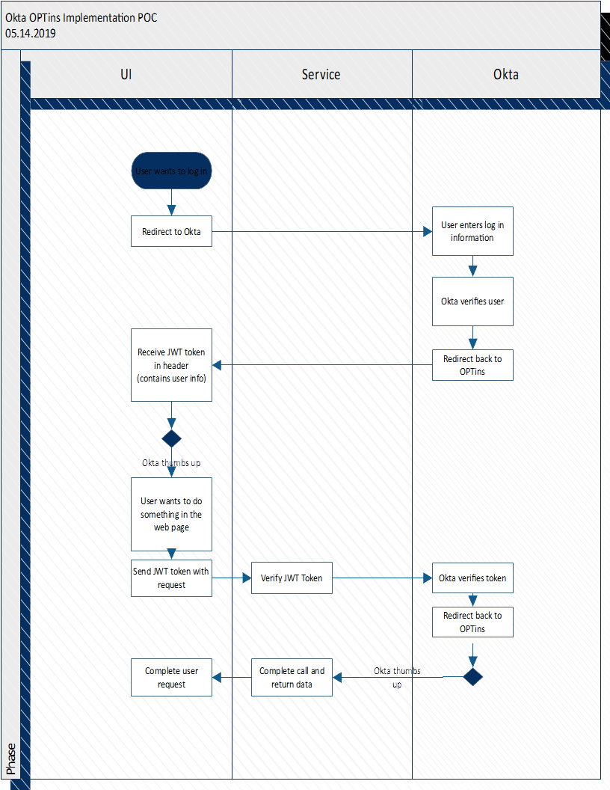

# Requirements for Okta Web App Proof of Concept

## Requirements

1. User hits app page and is redirected to Okta for login
2. User logs into Okta
3. (Possible path) User must accept scopes and claims requested y application for information sharing.  Typically this is done on first login to app only (handled by Okta).
4. User is redirected back to app and app receives user JWT in header indicating they are logged in.
5. App decrypts and decodes the JWT to display information retrieved from Okta in the JWT.
6. User enters some search criteria (first name, last name, email, and/or login) and indicates they want to search for users.
7. App calls service to search for users, but must send not only search criteria, but also include te Auth/JWT in the header to indicate the logged in user asking the question.
8. Service receives the call and extracts the Auth/JWT token.
9. Service call Okta to verify the token is still valid (or decrypts/decodes the token and uses Okta routines to verify token without needed additional call to Okta to re-verify token).
10. If token valid, then call Okta to search for users (using their API) based on entered search criteria.  Map Okta response to our response type and return.
11. If token invalid, return 403 error.

## Front end app items to be accomplished

1. Base project
1. Okta npm package
1. Route Guard
1. Login page
1. Store JWT
1. User search page

### Other Concerns:

* See [Open Id Standards](https://openid.net/specs/openid-connect-core-1_0.html#StandardClaims) for OIDC scopes and claims information.
* Refresh of token.  Tokens time out and need to be "re-upped" based on exp.
* What happens on app when token invalid.
* What happen on service calls when token invalid.
* Pop up to tell inactive user token is about to time out.
* Must use TLS for all interactions.
* What happens when user accepts some scopes/claims, but denies others?
* Provide link for user to Okta profile management.
